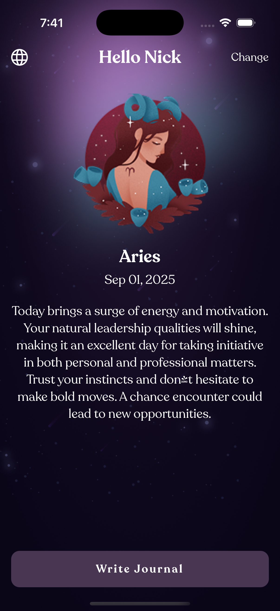
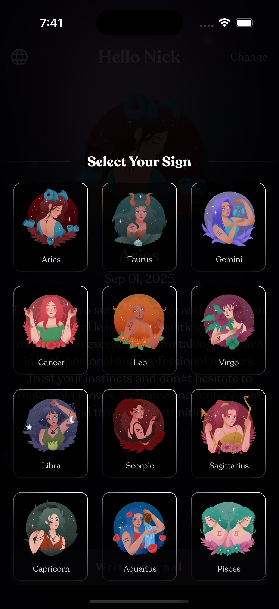
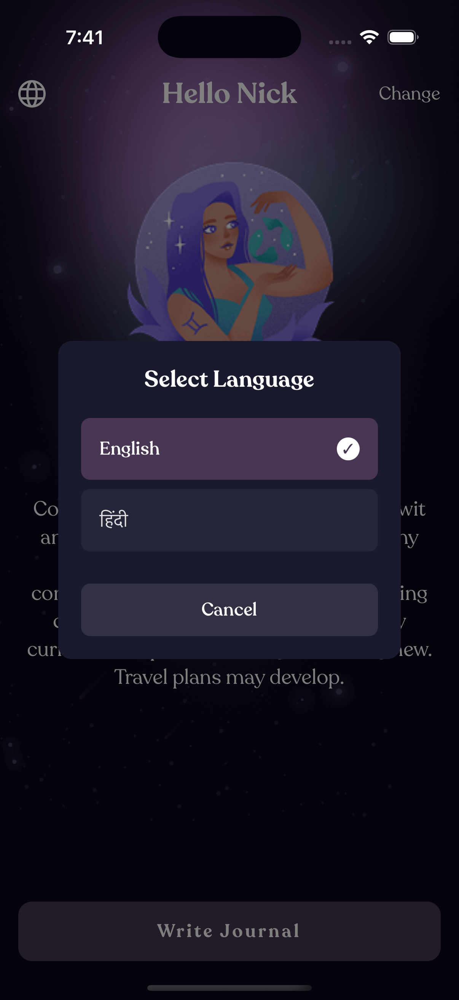
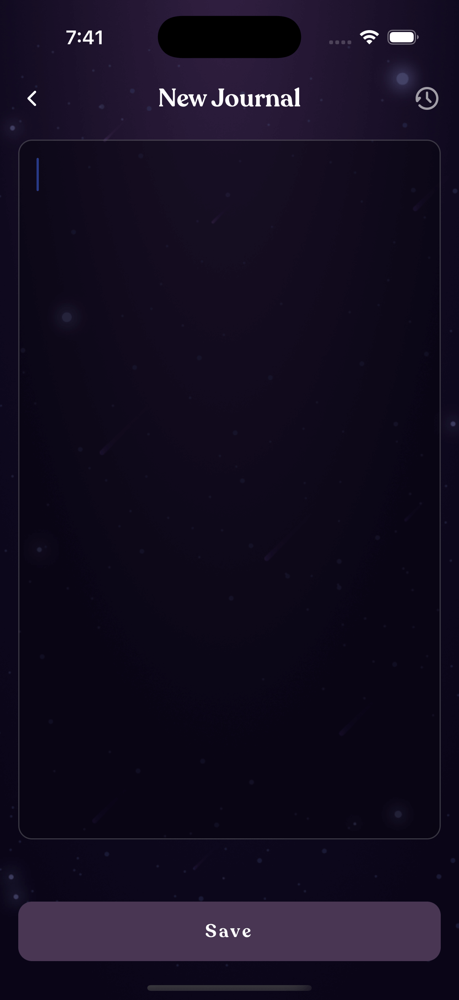
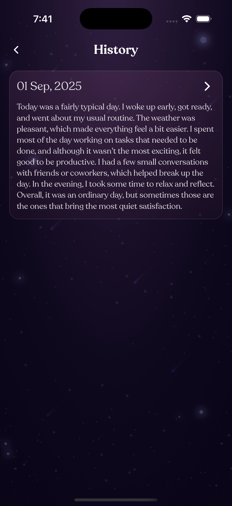
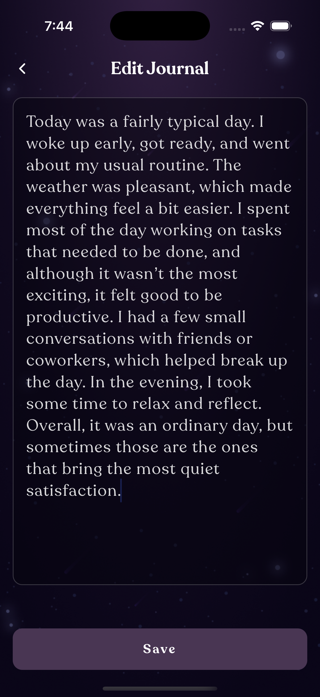

# 🌟 Astro - Personalized Horoscope & Journal App

A beautiful, multilingual React Native app that provides personalized daily horoscopes and journaling capabilities. Built with Expo, featuring zodiac-based insights and seamless language switching between English and Hindi.

## 📱 Screenshots

<div align="center">
  
### Home Screen & Horoscope


_Daily horoscope display in English and Hindi with beautiful zodiac imagery_

### Zodiac Selection & Language Support

 


_Interactive zodiac selection and seamless language switching_

### Journal Features

 



_Elegant journal writing interface and organized history view_

</div>

## ✨ Features

### Current Features

- **🔮 Daily Horoscopes** - Personalized zodiac-based predictions
- **📝 Journal Integration** - Write and save personal thoughts
- **🌐 Multilingual Support** - English and Hindi (हिंदी) languages
- **♈ Zodiac Selection** - All 12 zodiac signs with beautiful imagery
- **📱 Modern UI** - Clean, gradient-based design with haptic feedback
- **💾 Local Storage** - Offline-first approach with AsyncStorage
- **🎨 Custom Fonts** - Recoleta font family for elegant typography
- **📊 History Tracking** - View and manage past journal entries
- **🌙 Dark Theme** - Optimized for low-light usage

## 🚀 Quick Start

### Prerequisites

- Node.js (v18 or higher)
- npm or yarn
- Expo CLI
- iOS Simulator (for iOS development)
- Android Studio & Emulator (for Android development)

### Installation

1. **Clone the repository**

   ```bash
   git clone <repository-url>
   cd astro
   ```

2. **Install dependencies**

   ```bash
   npm install
   # or
   yarn install
   ```

3. **Start the development server**

   ```bash
   npm start
   # or
   yarn start
   ```

4. **Run on your preferred platform**
   - **iOS**: Press `i` in the terminal or `npm run ios`
   - **Android**: Press `a` in the terminal or `npm run android`
   - **Web**: Press `w` in the terminal or `npm run web`

### Development Commands

```bash
# Start Expo development server
npm start

# Run on specific platforms
npm run android
npm run ios
npm run web

# Lint code
npm run lint

# Reset project (if needed)
npm run reset-project
```

## 🏗️ Project Structure

```
astro/
├── app/                    # App screens (Expo Router)
│   ├── index.tsx          # Home screen with horoscopes
│   ├── journalscreen.tsx  # Journal writing/editing
│   ├── historyscreen.tsx  # Journal history
│   └── _layout.tsx        # Root layout configuration
├── assets/                # Static assets
│   ├── fonts/            # Custom Recoleta fonts
│   ├── images/           # App images and zodiac icons
│   └── svgs/             # SVG components and icons
├── components/            # Reusable UI components
│   ├── HapticTab.tsx     # Haptic feedback button
│   ├── LanguageSelector.tsx # Language switching modal
│   ├── Loader.tsx        # Loading indicator
│   └── ZodiacSheet.tsx   # Zodiac selection sheet
├── constants/            # App constants
│   ├── Colors.ts         # Centralized color palette
│   ├── Fonts.ts          # Font family and styles
│   └── Zodiac.ts         # Zodiac signs data
├── data/                 # Static data
│   └── fallbackHoroscopes.ts # Offline horoscope content
├── hooks/                # Custom React hooks
├── locales/              # Internationalization
│   ├── en.json          # English translations
│   └── hi.json          # Hindi translations
├── services/             # External services
│   └── NetworkManager.ts # API and fallback logic
├── types/                # TypeScript type definitions
│   └── journal.ts       # Journal data types
└── utils/                # Utility functions
    ├── i18n.ts          # Internationalization setup
    └── storage.ts       # AsyncStorage utilities
```

## 🔧 Configuration

### Adding New Languages

1. Create a new locale file in `locales/[language-code].json`
2. Add translations following the existing structure
3. Update `utils/i18n.ts` to include the new language
4. Add the language option in `components/LanguageSelector.tsx`

### Customizing Colors

All colors are centralized in `constants/Colors.ts`. Update this file to change the app's color scheme:

```typescript
export const Colors = {
  primaryBackground: "#493653", // Main purple background
  white: "#FFFFFF", // Primary text color
  whiteTransparent: "#FFFFFFD9", // Secondary text color
  // ... other colors
};
```

### Adding New Zodiac Signs

Update `constants/Zodiac.ts` and add corresponding images in `assets/images/zodiacs/`.

## 🌟 Future Roadmap

### Phase 1: Enhanced Personalization

- **🔐 User Profiles** - Personal accounts with preferences
- **🎯 AI-Powered Insights** - Machine learning for personalized predictions
- **📈 Mood Tracking** - Emotional state correlation with horoscopes
- **⏰ Smart Notifications** - Personalized reminder timings
- **🌙 Lunar Calendar** - Moon phase integration

### Phase 2: Social Features

- **👥 Community** - Share insights with friends
- **💌 Anonymous Sharing** - Share journal entries anonymously
- **🏆 Achievements** - Journaling streaks and milestones
- **📊 Analytics** - Personal growth tracking
- **🤝 Compatibility** - Zodiac relationship insights

### Phase 3: Advanced Features

- **🎙️ Voice Journaling** - Audio diary entries
- **📸 Photo Journaling** - Visual memory keeping
- **🧘 Guided Meditation** - Zodiac-based mindfulness
- **📅 Advanced Calendar** - Astrological event tracking
- **🎨 Themes** - Multiple UI themes and customization

### Phase 4: Premium Features

- **⭐ Premium Horoscopes** - Detailed astrological charts
- **💎 Advanced Analytics** - Comprehensive personal insights
- **🎯 Custom Predictions** - Personalized forecast periods
- **📱 Widget Support** - Home screen horoscope widgets
- **☁️ Cloud Sync** - Cross-device synchronization

### Phase 5: Platform Expansion

- **⌚ Watch App** - Quick horoscope access
- **💻 Web Platform** - Full-featured web application
- **🤖 Chatbot** - AI astrology assistant
- **📧 Email Integration** - Daily horoscope newsletters
- **🔗 Third-party Integrations** - Calendar and fitness apps

## 🛠️ Technical Enhancements

### Performance Optimizations

- **⚡ Code Splitting** - Lazy loading for better performance
- **🗜️ Bundle Optimization** - Reduce app size
- **💨 Caching Strategy** - Improved offline experience
- **🔄 Background Sync** - Seamless data synchronization

### Development Experience

- **🧪 Testing Suite** - Comprehensive unit and E2E tests
- **🚀 CI/CD Pipeline** - Automated deployment
- **📊 Analytics Integration** - User behavior insights
- **🐛 Error Tracking** - Crash reporting and monitoring

### Security & Privacy

- **🔒 End-to-end Encryption** - Secure journal entries
- **🛡️ Privacy Controls** - Granular data permissions
- **✅ GDPR Compliance** - European privacy standards
- **🔐 Biometric Authentication** - Secure app access

## 🤝 Contributing

We welcome contributions! Please read our contributing guidelines and code of conduct before submitting pull requests.

### Development Setup

1. Follow the installation steps above
2. Create a feature branch: `git checkout -b feature/amazing-feature`
3. Make your changes and test thoroughly
4. Submit a pull request with a clear description

---

**Built with ❤️ using React Native & Expo**

For questions or support, please open an issue or contact the development team.
